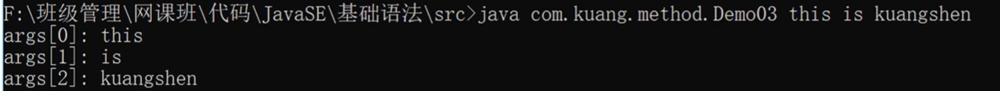

# JavaSE

## Hello world

```java
public class hello{
    public static void main(String[] args){
		System.out.print("Hello,World")
    }
}
```

javac编译

java执行class文件

## 基本数据

```java
int i=10;
int i2=010;
int i3=0x10
int i4=10_0000_0000
//i=10 i2=8 i3=16 i4=1000000000前缀0代表8进制，前缀0x代表16进制
```

## 类型转换

```java
//低---------------->高
//byte,short,char->int->long->float->double
```

强制转换 高->低

自动转换 低->高

## 变量、常量

```java
public class demo{
    static int a//类变量，方法直接引用
    int b//实例变量，需要将类实例化
    static final int d//常量，方法直接引用
    public static void main(String[] args){
        int c//局部变量
	}
}
```

## Javadoc


```java
package com.ddhen.base;
//类doc
/**
 * @author zsy
 * @version 1.0.1
 * @since 1.8
 */
public class Doc {
    String name;
	//方法doc
    /**
     * 
     * @param name
     * @return
     * @throws Exception
     */
    public String test(String name) throws Exception{
        return name;
    }
}

```

## Switch

```java
public class Switch {
    public static void main(String[] args) {
        char grade='c';
        switch (grade){
            case 'A':
                System.out.println('A');
                break;
            case 'B':
                System.out.println('B');
                break;
            case 'C':
                System.out.println('C');
                break;
            case 'D':
                System.out.println('D');
                break;
            default:
                System.out.println("wrong");
        }
    }
}
//不加break会产生case穿透现象
```

## 增强for循环

```java
public class demo{
    public static void main(String[] args){
        int[] nums={1,2,3,4,5};
        for(int x:nums){
            System.out.println(x);
        }
    }
}
```

## 方法

```java
public class Demo01 {
    public static void main(String[] args) {
        int i=add(1,2);
        System.out.println(i);
    }
    //加上static后就是类方法，其他方法可以直接引用
    public static int add(int a,int b){
        return a+b;
    }
}

```

## 命令行传参

运行一个程序时候再给它传递消息。依靠cmd实现



## 内存分析


## 继承

```java
public class Student extends Person{
    
}//Student继承了Person类
//Ctrl+H可以打开继承树
//所有类都继承object类
//Java取消了多重继承
```

```java
public Student(){
    //隐藏代码：调用父类的无参构造
    System.out.println('1')
}
public Person(){
    System.out.println('2')
}
```

## 多态

对于静态方法来说

```java
public class B{
    public static void test(){
        System.out.println("B==>test()")
    }
}

public class A extends B{
    public static void test(){
        System.out.println("A==>test()")
    }
}

public class demo{
    public static void main(){
        A a=new A();
        B b=new A();
        a.test();
        b.test();
    }
}
//A==>test()
//B==>test()
```

对于非静态方法

```java
public class B{
    public void test(){
        System.out.println("B==>test()")
    }
}

public class A extends B{
    public void test(){
        System.out.println("A==>test()")
    }
}

public class demo{
    public static void main(){
        A a=new A();
        B b=new A();
        a.test();
        b.test();
    }
}
//A==>test()
//A==>test()
```

Alt+insert: override 在子类中选择父类方法进行重写覆盖

Alt+enter 快速新建对象

父类的引用可以指向子类的实例

==对象能执行哪些方法看引用类型==

## 静态代码块

```java
public class Person{
    {
        System.out.println('匿名代码块');
        //匿名代码块，创建对象实例时自动创建
    }
    
    static{
        System.out.println('静态代码块');
        //静态代码块
        //创建类时创建
    }
    public Person(){
        System.out.println('构造方法');
    }
    public static void main(String[] args){
        Person person1=new Person();
        System.out.println("=========");
        Person person2=new Person();
    }
}
/*
静态代码块
*/
```

## 静态导入包

```java
import static java.lang.Math.random;
public class Test{
    public static void main(String[] args){
        System.out.println(random());
        //达到简略的目的，不用写math.random()
    }
}
```

## 抽象类

```java
public abstract void Action(){
    public abstract dosomething(){}
   	public B(){}
}
```

抽象类无法实例化

抽象类中可以有普通方法

## 接口

只负责定义规范

```java
public interface UserService(){
    //接口中所有定义都默认是public abstract
    //接口简便写直接 返回值类型+方法名
    void add();
    void delete();
    
}
```

```java
public class UserServiceImpl implements UserService{
    public void add(){
        
    }
    public void delete(){
        
    }
}
```

接口不包含实例变量，但可以有static final常量(==并不常用==)
